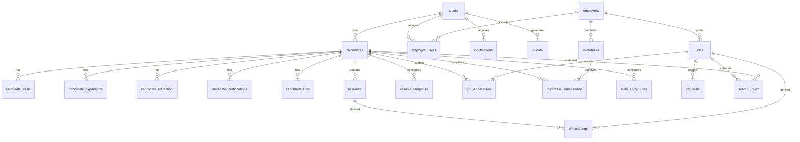

# AutoHire Data Model

This document outlines the PostgreSQL schema that underpins AutoHire. Field types and constraints are indicative and will be refined during implementation.

## Entity Relationship Overview

## Table Definitions

### users

| Column | Type | Notes |
| --- | --- | --- |
| id | UUID PK | Generated via `uuid_generate_v4()` |
| email | CITEXT UNIQUE | RFC 5322 validation |
| password_hash | TEXT | Argon2 hashed |
| role | ENUM | `anonymous`, `candidate`, `employer`, `org_admin`, `system_admin` |
| created_at | TIMESTAMP WITH TIME ZONE | Default `now()` |
| last_login | TIMESTAMP WITH TIME ZONE | Nullable |

### candidates

| Column | Type | Notes |
| --- | --- | --- |
| id | UUID PK |
| user_id | UUID FK -> users.id | ON DELETE CASCADE |
| first_name | TEXT | |
| last_name | TEXT | |
| city | TEXT | |
| country | TEXT | ISO-3166 alpha-2 |
| phone | TEXT | E.164 formatted |
| summary | TEXT | Max 2k chars |
| work_rights | TEXT | Enum at app level |
| desired_pay_min | INTEGER | Stored in cents |
| desired_pay_max | INTEGER | Stored in cents |
| work_type | TEXT | `full_time`, `part_time`, etc. |
| availability | TEXT | |
| relocation | BOOLEAN | |
| created_at | TIMESTAMPTZ | |
| updated_at | TIMESTAMPTZ | |

### candidate_skills

| Column | Type | Notes |
| --- | --- | --- |
| candidate_id | UUID FK -> candidates.id | ON DELETE CASCADE |
| skill | TEXT | Normalized lowercase |
| level | SMALLINT | 0–5 |

Composite PK: `(candidate_id, skill)`.

### candidate_experience

Fields include `title`, `employer`, `start_ym`, `end_ym`, `description`, `achievements JSONB`, and `skills TEXT[]` with indexes for search.

### candidate_education / candidate_certifications / candidate_links

Standard repeatable entries with foreign key back to `candidates` and timestamps for auditing.

### resumes

| Column | Type | Notes |
| --- | --- | --- |
| id | UUID PK |
| candidate_id | UUID FK -> candidates.id | |
| object_key | TEXT | MinIO object reference |
| original_filename | TEXT | |
| mime | TEXT | |
| parsed_json | JSONB | Extracted structured fields |
| created_at | TIMESTAMPTZ | |

### resume_templates

Stores structured template definitions and metadata for generating polished CVs.

### employers & employer_users

Organizations and their associated users with `role` (`recruiter`, `admin`). Include billing placeholders for future expansion.

### jobs

Primary job postings with compensation bands, location data (`lat`, `lon`, `city`, `country`), visibility, and timestamps. Relationships to `job_skills` and `job_applications` support tagging and pipeline management.

### job_applications

Tracks candidate submissions with `status` (`new`, `screen`, `interview`, `offer`, `hired`, `rejected`), `source`, optional `resume_id`, and audit timestamps.

### microtasks & microtask_submissions

Microtask campaigns include payout, estimated minutes, deadlines, capacity, and `qualification_tags TEXT[]`. Submissions capture responses, attachments, status transitions, reviewer info, and decision timestamps.

### search_index

Stores denormalized documents used for Meilisearch ingestion. `type` enumerates `job` or `candidate` with `ref_id` linking back to the canonical record.

### embeddings

Maintains vector representations for resumes, jobs, and candidates. Column structure: `vector REAL[]` (384 dimensions) with metadata in `payload JSONB`.

### events & notifications

Event stream captures behavior for analytics. Notifications include payload JSON and `read_at` markers.

### auto_apply_rules

Defines rule sets with serialized query JSON, daily limits, hour windows, and references to resume templates. Execution logs are stored separately in the worker service.

## OpenCATS Integration Tables

Mappings to OpenCATS involve `candidate`, `attachment`, `joborder`, and `candidate_joborder`. Version-specific migrations introspect remote schema prior to synchronization to ensure compatibility.

## Indexing & Constraints

- Unique indexes on email, organization + slug, job external IDs.
- GIN indexes for JSONB search fields (`parsed_json`, `qualification_tags`).
- PostGIS (optional) for geospatial queries on job locations.

