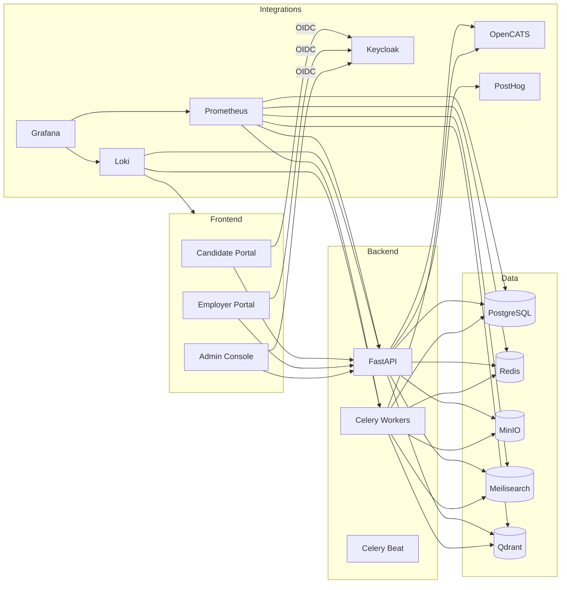

# System Architecture

This document describes the service topology, deployment model, and technology choices for AutoHire.

## High-Level Architecture

AutoHire follows a service-oriented architecture with a mono-repository housing multiple deployable units. Core components include:

- **Frontends:** Three Next.js 14 applications (Candidate, Employer, Admin) sharing a design system and leveraging the App Router.
- **Backend API:** FastAPI application exposing REST endpoints and orchestrating business logic.
- **Background Workers:** Celery workers for resume parsing, scraping, auto-apply automation, and asynchronous notifications.
- **Search Layer:** Meilisearch for keyword search and Qdrant for semantic search embeddings.
- **Storage:** PostgreSQL for relational data, MinIO for file objects, and Redis for caching and task queues.
- **ATS Bridge:** Integration services syncing data to OpenCATS.
- **Observability:** Prometheus, Grafana, and Loki for metrics, dashboards, and logs.
- **Analytics:** PostHog OSS for event tracking and personalization.

## Deployment Topology

## Service Responsibilities

### API Service

- Authentication middleware (Keycloak JWT validation)
- Candidate profile and resume management
- Employer job and microtask management
- Hybrid search orchestration
- Notifications and event logging
- Admin endpoints for moderation and configuration

### Worker Service

- Resume parsing and normalization
- Hybrid search indexing
- Auto-apply execution and logging
- Microtask submission evaluation
- Scraping pipelines (Playwright-driven)
- Analytics aggregation and personalization jobs

### Frontend Applications

- **Candidate Portal:** Onboarding, profile, job discovery, microtasks, automation, notifications.
- **Employer Portal:** Organization management, job pipelines, microtasks, sourcing, ATS sync.
- **Admin Console:** Platform oversight, taxonomies, feature flags, observability links.

## Security Considerations

- Use Keycloak for SSO and role-based access control
- Enforce HTTPS and secure headers
- MinIO presigned URLs for file access
- Encrypt sensitive fields in PostgreSQL where required
- Provide GDPR-compliant data export and deletion flows

## Scaling Strategy

- Deploy each component as a container with horizontal scaling via orchestration (Docker Compose for local, Kubernetes or Nomad for production)
- Use Redis clustering for queue resilience if load increases
- Partition Celery workers by queue (parse, search, automation, scraping)
- Adopt Postgres read replicas for heavy reporting workloads

## Local Development

- Docker Compose orchestrates the full stack with developer-friendly defaults
- MailHog or Mailpit handles email testing
- Seed scripts provide sample data for quick onboarding
- `.env` files configure secrets; example env templates stored alongside services

